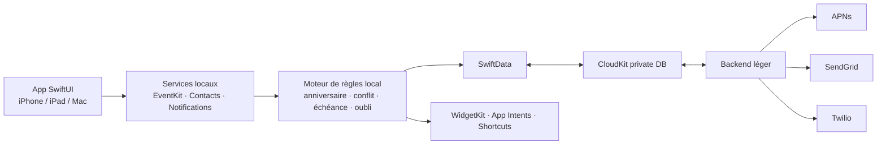
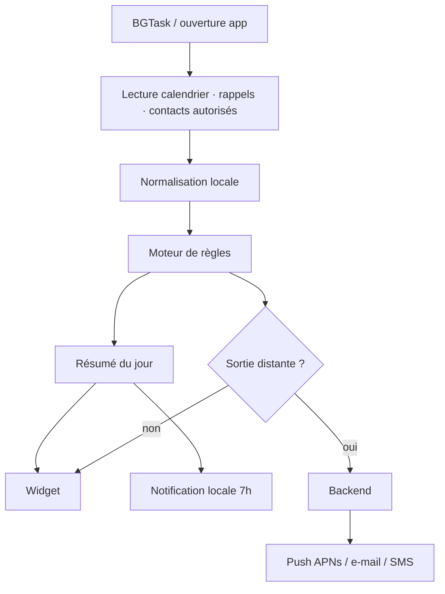

# Architecture

Aria suit une architecture **hybride local-first**. Tout ce qui peut être
résolu sur l'appareil l'est (lecture calendrier/rappels/contacts, calcul des
conflits, scoring de priorité, génération du briefing, UI widget + App Intents).
Le backend ne fait que les **sorties distantes** (push APNs, e-mail, SMS) et un
peu d'orchestration cross-device.

## Schéma cible

## Flux du briefing quotidien

## Couches

| Couche | Responsabilité | Technologies |
|---|---|---|
| Présentation | UI, widget, raccourcis | SwiftUI, WidgetKit, App Intents |
| Domaine | Règles, scoring, briefing | Swift pur (testable, sans dépendance framework) |
| Données système | Calendrier, rappels, contacts | EventKit, Contacts |
| Persistance | État, préférences, règles, logs légers | SwiftData + CloudKit (private DB) |
| Backend | Sorties distantes + orchestration | TypeScript serverless |

La **couche domaine est volontairement découplée** d'EventKit/Contacts via des
protocoles (`EventProviding`, `ContactProviding`) pour être testable sans
appareil. Voir `ios-app/Assistant/Rules/`.

## Matrice de faisabilité (résumé)

| Fonction | Faisable | Voie | Limite |
|---|---|---|---|
| Lire calendriers | ✅ | EventKit (`requestFullAccessToEvents`) | Consentement + purpose string |
| Lire/écrire rappels | ✅ | EventKit reminders | Idem |
| Contacts + anniversaires | ✅ | Contacts / ContactsUI | Accès limité possible (iOS 18) |
| Rappels J-30/J-7 | ✅ | Règles locales + notifications + APNs | Background iOS ≠ cron exact |
| Briefing quotidien | ✅ | Widget + notification locale | Qualité = logique métier |
| Créer / déplacer événements | ✅ | EventKit + App Intents | — |
| Rédiger e-mail | ✅ | `MFMailComposeViewController` (interactif) ou backend SMTP | Envoi auto = backend |
| Lire Apple Mail natif | ⚠️ | MailKit (macOS) / IMAP | Pas d'API iOS générale |
| Envoyer SMS sans interaction | ❌→⚠️ | Pas via Messages ; Twilio (numéro tiers) | — |
| Lire historique Messages | ❌ | À éviter | Non exposé iOS public |
| Automatiser Messages sur Mac | ⚠️ | Apple Events / AppleScript (agent macOS) | Sandbox, friction App Store |
| Accès direct Apple Notes | ❌ | Notes internes à l'app ou Shortcuts | Pas de NotesKit public |

**Règle d'or** : aucune API privée, aucune lecture de SQLite système, aucun
détournement de notifications. On reste dans le périmètre des API publiques et
du sandbox.

## Décisions d'architecture (ADR courts)

- **ADR-001 — SwiftData plutôt que Core Data brut.** Moins de boilerplate, pont
  CloudKit natif, suffisant pour des modèles simples. Repli Core Data possible
  si besoin de migrations fines.
- **ADR-002 — Backend stateless en dry-run par défaut.** Pas de secret = pas
  d'appel réseau réel. Facilite tests et CI sans fuite de clés.
- **ADR-003 — Contrats JSON validés par Zod côté backend** et structures
  `Codable` miroir côté Swift (`docs/backend-api.md`).
- **ADR-004 — Hébergement de départ : CloudKit + une fonction serverless**
  (Cloudflare Workers ou équivalent). Voir `docs/roadmap.md` §coûts.
