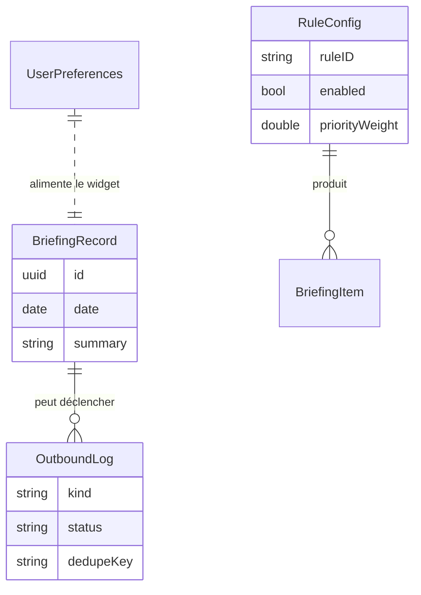

# Modèle de données

Aria stocke **uniquement ses données propres et dérivées** — pas une copie brute
du calendrier ou des contacts système. Les données système sont lues à la
demande via EventKit/Contacts. Ce qui est persisté : préférences, règles,
briefings générés, et un journal léger de notifications/sorties.

Persistance locale : **SwiftData**, synchronisée sur la base **privée CloudKit**
de l'utilisateur (container isolé par app, jamais partagé entre apps).

## Entités SwiftData

### `UserPreferences`
Réglages globaux (un seul enregistrement).

| Champ | Type | Notes |
|---|---|---|
| `id` | UUID | — |
| `briefingHour` | Int | Heure du briefing (défaut 7) |
| `briefingMinute` | Int | défaut 0 |
| `birthdayLeadDays` | [Int] | Jalons d'anticipation, défaut `[30, 7, 1]` |
| `enableTimeSensitive` | Bool | Autoriser les alertes Time Sensitive |
| `enabledRuleIDs` | [String] | Règles actives |
| `updatedAt` | Date | — |

### `BriefingRecord`
Un briefing généré pour une date donnée (historique + alimentation widget).

| Champ | Type | Notes |
|---|---|---|
| `id` | UUID | — |
| `date` | Date | Jour concerné (normalisé minuit local) |
| `summary` | String | Texte court affiché |
| `itemCount` | Int | Nombre d'items |
| `payloadJSON` | String | `BriefingItem[]` sérialisé (cf. backend-api.md) |
| `generatedAt` | Date | — |

### `RuleConfig`
Paramétrage d'une règle du moteur.

| Champ | Type | Notes |
|---|---|---|
| `id` | UUID | — |
| `ruleID` | String | ex. `birthday`, `conflict`, `deadline`, `forgotten` |
| `enabled` | Bool | — |
| `priorityWeight` | Double | Pondère le score (0…1) |
| `paramsJSON` | String | Paramètres spécifiques à la règle |

### `OutboundLog`
Journal léger des sorties (audit, anti-doublon, debug). Volontairement minimal.

| Champ | Type | Notes |
|---|---|---|
| `id` | UUID | — |
| `kind` | String | `push` · `email` · `sms` · `local-notification` |
| `status` | String | `queued` · `sent` · `failed` · `dry-run` |
| `dedupeKey` | String | Empêche les envois redondants |
| `createdAt` | Date | — |
| `detail` | String? | Message d'erreur éventuel (pas de contenu sensible) |

## Ce qui n'est PAS stocké

- Les événements/rappels bruts du calendrier (relus via EventKit à chaque run).
- Les fiches contacts complètes (seul l'`CNContact.identifier` + date
  d'anniversaire peuvent être mis en cache léger si nécessaire).
- Les clés API tierces (jamais côté client — voir `docs/permissions.md`).

## CloudKit

- **Container privé** par défaut (`iCloud.com.example.aria`).
- Synchro automatique via le pont SwiftData ↔ CloudKit (`ModelConfiguration`
  avec `cloudKitDatabase: .private`).
- Pas de base publique/partagée dans le MVP.
- Tous les attributs ont une valeur par défaut ou sont optionnels (contrainte
  du pont CloudKit).

## Schéma relationnel (logique)

`BriefingItem` n'est pas une entité persistée séparément : il est sérialisé dans
`BriefingRecord.payloadJSON` et partagé avec le backend (contrat commun).
